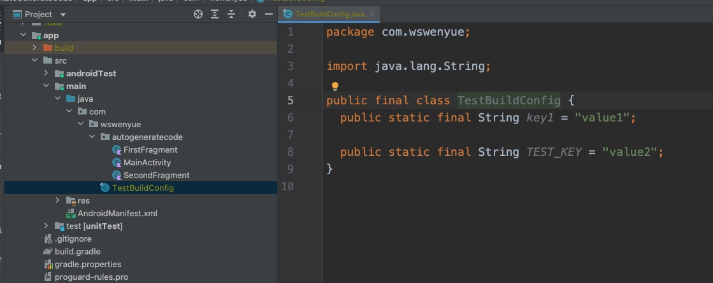

# AutoGenerateCodePlugin

## Introduction
**A gradle plugin that generates code automatically**

## Using AutoGenerateCodePlugin

Add the plugin section in your root project `build.gradle` file :

```gradle
plugins {
    id 'vip.wswenyue.AutoGenerateCode' version '0.1.0' apply false
}
```

And apply it in the app module `build.gradle` file :

```gradle
plugins {
    id 'vip.wswenyue.AutoGenerateCode'
}
```

### Configuration
Configure in any module you want to use. Add the following sample content to the `gradle.properties` file

```properties
agc.outDir=src/main/java
agc.className=TestBuildConfig
agc.package=com.wswenyue
agc.string.fields.key1=value1
agc.string.fields.TEST_KEY=value2
```

After build you will get:




Finally, don't forget to add Git ignore
```.gitignore
src/main/java/com/wswenyue/TestBuildConfig.java
```


## License
[BSD 2-Clause "Simplified" License](https://github.com/wswenyue/AutoGenerateCode/blob/main/LICENSE)
